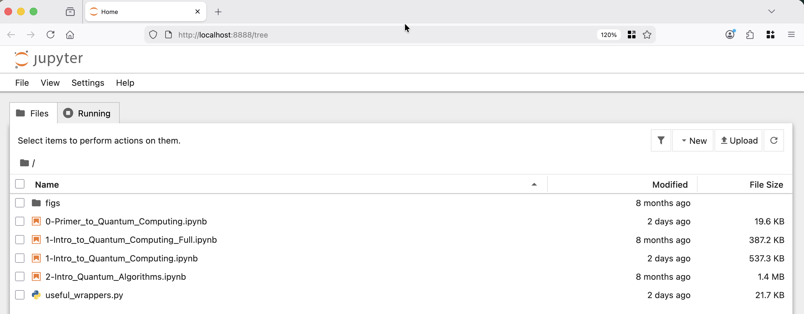

# Quantum Computing Hackathon 

This repo provides material to introduce Quantum Computing to students in secondary school. The lessons are laid out in the `lessons/` directory in the form of interactive, digital (jupyter) notebooks.  

## Setting up the notebooks

The digital notebooks make use of quite a variety of software behind the scenes. We have setup executables (scripts) to run that will install all the relevant software packages save Python[^1]. 

[^1]:To install Python, we suggest looking at this [material](https://realpython.com/installing-python/).

There are several ways of setting up the material for this hackathon. The simplest method relies on running scripts (executables) that install all the needed software in the local directory and then launching the "jupyter notebook" service, which opens up a page in your default browser.  

### Simple

The first step is download the repository and unpack it. The repository can be downloaded from 
* [this link](https://github.com/PawseySC/quantum-computing-hackathon/archive/refs/heads/main.zip). Once you unzip it, you should have a folder/directory called `quantum-computing-hackathon`. In this folder you see a scripts directory. 

#### For Windows

Run the executable `scripts/Launch_For_Windows.bat`. 

This will begin installing the needed software before opening up the Jupyter interface in a browser.

#### For Linux/MacOS

Open a terminal and go to this directory. Once there simply run
```bash
./scripts/Launch_For_Linux.sh
```
or MacOS as appropriate. 

This will begin installing the needed software before opening up the Jupyter interface in a browser.

### Advanced Users

For more advanced users using Linux or Mac, we suggest using git clone from a terminal and running the relevant scripts. 

```bash
git clone https://github.com/PawseySC/quantum-computing-hackathon.git
cd quantum-computing-hackathon
./scripts/Launch_For_Linux.sh
```

This will create a Python virtual environment in `venv` directory, use `pip` to install relevant packages and then launch Jupyter using the default browser. If desired, you can create virtual enviroments yourself and adjust the installation 

```bash
python3 -m venv <your_venv_dir>
source <your_venv_dir>/bin/activate 
pip install -r python/requirements
pip install <your_list_of_packages> 
```

After which you can launch jupter
```bash
jupyter notebook
```

## Lessons

The notebooks are in `lessons/` folder and consist of 

* `0-Primer_to_Quantum_Computing`: a non-interactive lesson that introduces 
  - programming concepts with a focus on the Python programming language
  - classical and quantum bits
  - quantum processes
  - quantum circuits (a way of visualising quantum computing algorithms)
* `1-Intro_to_Quantum_Computing`: a interactive lesson that covers
  - quantum computing basics
  - simple quantum operations 
* `2-Intro_Quantum_Algorithms`: a interactive lesson that covers
  - quantum computing algorithms 

These interactive digital (jupyter) notebooks are used via your browser (as seen in below)



You should see each notebook as a `.ipynb` file. When you launch a notebook it should open a new tab in the browser (as seen below)


For a tutorial on what a Jupyter notebook looks like and how to use it, have a look at [this](https://realpython.com/jupyter-notebook-introduction/).

## Prerequisites

We strongly suggest reading the material of lesson 0 and going through the videos from [Quantum Girls](https://www.quantumgirls.org/videos/quantum-explorers-stem-club-sessions) covering quantum mechanics and computing before running these lessons. We also recommend having some base knowledge of programming and the Python programming language.


